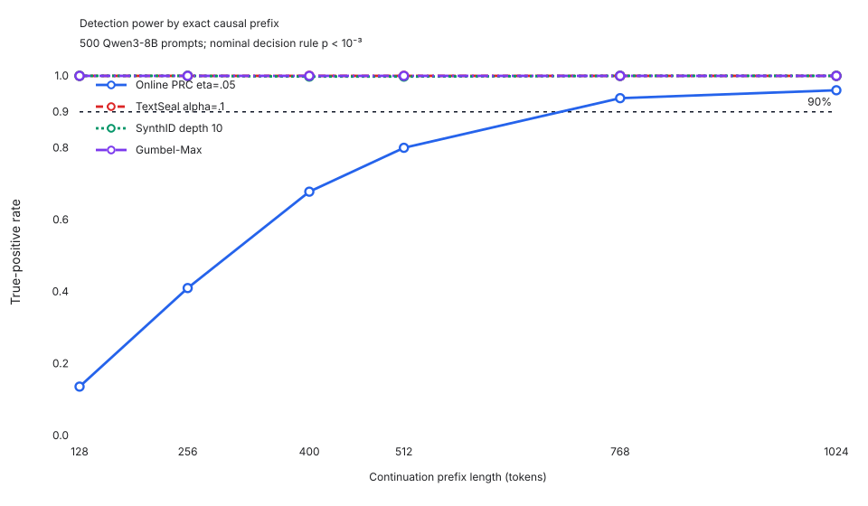
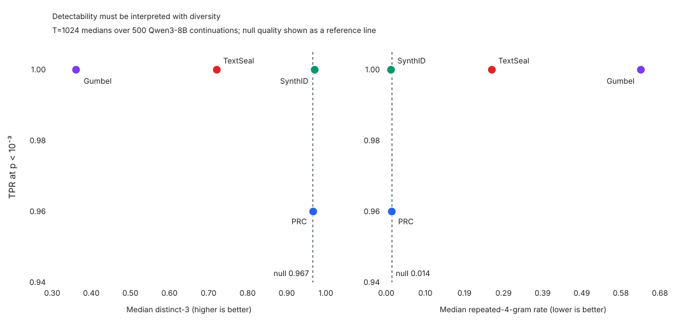

# Final two-day sprint closeout

Status: **the approved core sprint is complete**. No additional model run is
needed for the primary conclusions. The remaining items are optional extensions
that require separate scope and approval.

## What completed

| Workstream | Outcome | Exact incremental cost |
| --- | --- | ---: |
| 8B online PRC eta 0.05 boundary | Exact `n90=640`; MAP `452/500` | $1.20659284 |
| 8B online PRC eta 0.10 boundary | Exact `n90=1407`; MAP `451/500` | $4.75144472 |
| 14B matched-reference checks | Two cache-only rows; zero GPU and zero generation | $0.01754523 |
| Fixed versus online | Seven paired cells and 3,500 prompt pairs | $0.04505808 |
| Controlled 8B baselines | Official integration, smoke, diagnostic, 500 prompts, scoring | $4.22362341 |
| 0.6B proxy detector | All four PRC etas plus common-length sensitivity; zero generation | $3.21783640 |
| **Scoped sprint total** | Non-overlapping, before workspace credits | **$13.46210068** |

The sprint total excludes older eta 0.15/0.20 generation campaigns that were
already complete when this final sprint began. Their costs remain in their
original ledgers.

## Online PRC operating points

| Eta | Selected boundary or ceiling | Native 8B MAP result | Interpretation |
| ---: | ---: | ---: | --- |
| 0.05 | `n90=640`, bracket `(639,640]` | 452/500 (90.4%) | exact crossing |
| 0.10 | `n90=1407`, bracket `(1406,1407]` | 451/500 (90.2%) | exact crossing |
| 0.15 | `n90 > 4096` | 448/500 (89.6%) at 4096 | right-censored ceiling |
| 0.20 | `n90=13088`, bracket `(13072,13088]` | 451/500 (90.2%) | exact crossing |

The eta 0.15 cell must remain a lower bound. Extending it was outside the
approved cost gate and is not needed for the main controlled baseline table.

## Controlled 8B comparison

The frozen comparison used Qwen3-8B-Base, 500 canonical prompts, exactly 1,024
generated tokens, temperature 1.0, top-p 1.0, and exact causal prefixes
`T={128,256,400,512,768,1024}`. Online PRC used `t=3, eta=0.05`; TextSeal used
`alpha=0.1`; SynthID-Text used depth 10 and the frequentist detector; Gumbel-Max
used the pinned TextSeal comparison path.

| Method | TPR at 128 | TPR at 400 | TPR at 1024 | Median `-log10(p)` at 1024 | Median repetition at 1024 | Median distinct-3 at 1024 |
| --- | ---: | ---: | ---: | ---: | ---: | ---: |
| Online PRC | 13.6% | 67.8% | 96.0% | 11.26 | 0.014 | 0.968 |
| TextSeal | 100.0% | 100.0% | 100.0% | 280.15 | 0.262 | 0.721 |
| SynthID-Text | 100.0% | 99.8% | 100.0% | 202.08 | 0.012 | 0.972 |
| Gumbel-Max | 100.0% | 100.0% | 100.0% | 142.20 | 0.633 | 0.361 |
| Shared null | -- | -- | -- | -- | 0.014 | 0.967 |

At T=1024 every method had 0/500 observed false positives. Across all six
prefixes, TextSeal had one FP at T=128 and one at T=768; SynthID had one at
T=128; and Gumbel-Max had one, one, and two at T=128, 256, and 400. PRC had
zero at every prefix. These are descriptive counts, not tight empirical
validation of a nominal 0.1% FPR.

### Scientific meaning

- **SynthID is the strongest observed joint operating point under the frozen
  setting.** It reaches essentially saturated detection while retaining
  null-like repetition and distinct-3. This conclusion is conditional on its
  normal-approximation calibration and the tested model/decoding regime.
- **Online PRC eta 0.05 preserves quality and diversity.** Its detection builds
  more slowly with length, reaching 96% at T=1024 rather than saturating at the
  earliest prefixes.
- **TextSeal and Gumbel-Max are not quality-matched detection wins.** Their
  strong detection accompanies material looping under this controlled setting.
  TextSeal's second seed reproduced the effect, and the paper-style
  temperature 0.8/top-p 0.9/T=400 sensitivity reduced but did not eliminate it.
  The result should be described as method-by-model-and-setting behavior, not a
  universal claim about TextSeal.
- **Base-model NLL alone is misleading here.** The looping TextSeal and Gumbel
  outputs have low base-model NLL, so NLL must be read jointly with repetition
  and distinct-n rather than treated as a complete quality proxy.

The official-reference checks passed: pinned TextSeal statistics agreed on all
6,000 comparisons with maximum absolute p-value difference `3.4802e-7`, and
SynthID token/g-value checks were exact. Exact-prefix, deduplication, schema,
prompt-coverage, finite-value, and zero-regeneration checks also passed.
Gumbel-Max is deterministically keyed at fixed batch shape, as expected; its
batch-shape sensitivity reflects small model-logit/numerical differences
amplified by deterministic autoregression, not ordinary sampling-seed
stochasticity or a power-form/log-space mismatch.

Final closeout verification passed 21 focused baseline tests and three focused
proxy-analysis tests, plus exact cost recomputation, SVG/XML validation,
workbook formula-error scanning, and visual review of all workbook sheets.

## Fixed versus online PRC

The paired analysis covered seven matched cells and 21 detector comparisons.
For the five 8B cells, none called either construction better after the
predeclared effect-size and uncertainty rules: two were practically equivalent
and 13 were inconclusive. This does **not** justify claiming general
equivalence. It means the available 500-prompt paired comparisons did not show
a practically meaningful winner.

Only the 0.6B eta 0.15, n=1504 naive comparison remained significant after
Holm correction across all 21 tests. The full paired results are in
`fixed_vs_online_analysis.md` and
`outputs/fixed_vs_online_paired_summary.csv`.

## Proxy detector result

Teacher-forcing the same cached 8B texts through Qwen3-0.6B reduced PRC MAP
power at every selected boundary or ceiling:

| Eta | Length status | Native 8B TPR | Proxy 0.6B TPR | Change |
| ---: | --- | ---: | ---: | ---: |
| 0.05 | exact boundary, 640 | 90.4% | 76.2% | -14.2 points |
| 0.10 | exact boundary, 1407 | 90.2% | 83.0% | -7.2 points |
| 0.15 | censored ceiling, 4096 | 89.6% | 86.4% | -3.2 points |
| 0.20 | exact boundary, 13088 | 90.2% | 86.6% | -3.6 points |

Therefore Qwen3-0.6B is a conservative sensitivity analysis, not a drop-in
replacement for native 8B probabilities. TextSeal remained saturated when its
entropy weights were recomputed with the proxy; SynthID and Gumbel-Max were
unchanged because their frequentist hash-based detectors do not depend on a
probability model. Quality metrics remain properties of the original 8B
generations.

## Calibration and interpretation limits

- PRC reports a Hoeffding p-value upper bound.
- TextSeal reports a moment-matched Gamma approximation.
- SynthID reports a normal approximation.
- Gumbel-Max reports an exact Gamma test.

These p-values have different calibration constructions and should not be
treated as interchangeable evidence scales. Five hundred null texts provide
only coarse empirical resolution around a nominal `1e-3` FPR. PRC eta and
TextSeal alpha are unrelated method parameters; comparisons must use observed
detection-quality-diversity operating points, not equal numeric parameter
values.

## Reproducibility and handoff

- Consolidated exact billing: `outputs/final_sprint_cost_ledger.csv`
- Closeout workbook: `outputs/final_sprint_closeout.xlsx`
- Final fingerprints and validation: `outputs/final_sprint_validation_manifest.json`
- Controlled baseline report: `controlled_baseline_full_report.md`
- Proxy report and replay instructions: `proxy_8b_detector_report.md` and
  `proxy_8b_detector_runbook.md`
- Baseline production runbook: `controlled_baseline_full_run_runbook.md`

The pre-existing uncommitted `online_causal_results_summary.csv` change was
preserved verbatim and excluded from the closeout commit. Its current
fingerprint is recorded as provenance; authoritative selected-boundary values
were independently checked against `hoeffding_results_summary.csv` and the
prompt-level artifacts.

## What remains

Nothing remains for the approved core sprint. The following are optional,
separately scoped extensions:

1. The 50-prompt by five-seed diversity subset for Self-BLEU and pairwise token
   agreement.
2. A faithful Qwen3.5-27B TextSeal paper replication.
3. A 4B proxy sensitivity analysis.
4. Extending the censored eta 0.15 boundary beyond 4096 tokens.

None should be launched automatically from this handoff.
