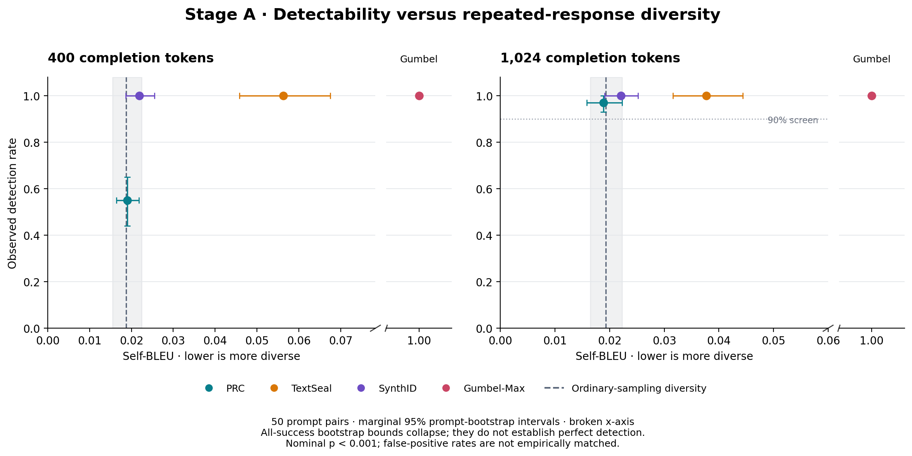

# Stage A: detectability versus pairwise Self-BLEU

Completed 2026-09-18 on `comparison-with-redetect`. **The pilot does not establish a useful PRC advantage over default SynthID. Do not expand to the full grid or the large null campaign on this evidence.** PRC preserves ordinary-sampling diversity and passes the provisional 90% detection screen at 1,024 tokens. Its diversity improvement over SynthID is small and uncertain, while its observed detection is lower, particularly at 400 tokens. This is an exploratory result from one selected batch and one fixed key per method.

## Main results

Self-BLEU is on a 0–1 scale; lower means more diverse responses to the same prompt. Parentheses give marginal 95% prompt-bootstrap intervals. Detection uses the saved **raw completion only**, with each method's nominal p < 0.001 rule; false-positive rates have not been empirically matched.

| Setting | Self-BLEU, 400 tokens | Detection, 400 | Self-BLEU, 1,024 tokens | Detection, 1,024 |
|---|---:|---:|---:|---:|
| Online PRC, eta .05 | .0190 (.0164–.0218) | 55/100 (44–65%) | .0189 (.0158–.0223) | 97/100 (93–100%) |
| TextSeal, alpha .1 | .0563 (.0458–.0675) | 100/100 | .0377 (.0316–.0444) | 100/100 |
| SynthID, depth 10 | .0219 (.0186–.0255) | 100/100 | .0221 (.0191–.0252) | 100/100 |
| Gumbel-Max | 1.0000 | 100/100 | 1.0000 | 100/100 |
| Ordinary sampling | .0187 (.0155–.0225) | — | .0193 (.0165–.0223) | — |

There are **50 prompt clusters and two response slots per prompt**, not 100 independent observations. Gumbel produces the same response under both sampling seeds, so its 100 slots contain only 50 distinct prompt responses. All-success percentile bootstrap intervals collapse to [100%,100%]; that does not establish perfect population detection.

Paired contrasts use the same resampled prompts for both methods:

| PRC minus comparator | Self-BLEU difference, 400 tokens | Self-BLEU difference, 1,024 tokens |
|---|---:|---:|
| TextSeal | −.0373 [−.0482, −.0272] | −.0188 [−.0256, −.0121] |
| SynthID | −.0029 [−.0066, +.0009] | −.0032 [−.0073, +.0010] |
| Gumbel-Max | −.9810 [−.9836, −.9782] | −.9811 [−.9842, −.9777] |

PRC's detection difference from each baseline is −45 percentage points [−56,−35] at 400 tokens and −3 points [−7,0] at 1,024. PRC has a clear diversity advantage over default TextSeal and deterministic Gumbel. At 1,024 tokens, its .0188 gap from TextSeal is near the predeclared .02 practical margin; its .0032 gap from SynthID is much smaller, and the interval includes zero. These results establish neither PRC superiority over SynthID nor equality between them.

## Decision and smallest useful follow-up

**No-go for immediate large expansion.** The main potential selling point—ordinary-sampling diversity at useful detection—is also approximately achieved by default SynthID here. Increasing to five responses per prompt would not address the main remaining question.

If a comparison of parameter tradeoffs is still valuable, the next bounded experiment is Stage B on the **same 50 prompts and two responses**: prioritize TextSeal alpha .5 and SynthID depth 2, reuse the saved alpha-zero pairs, and include depths 20 and 30 before making a claim about the parameter frontier. Alpha zero already has full-length pairs; the other parameter checks saved in step 3 have only 128 tokens and cannot replace full-length responses. Freeze and price that request separately. No Stage B job was launched by this analysis. A broad claim about SynthID would additionally require its Bayesian detector; this pilot evaluates the weighted-mean frequentist variant only.

If a small difference becomes worth resolving after Stage B, add prompt batches before increasing responses per prompt. Retain the pilot separately and reserve unseen prompts for confirmation. Do not tune settings, keys or prompt selection merely to obtain a PRC win.

## False positives and detector sensitivity

All four detectors returned **0/100** false positives on the fresh ordinary-sampling responses at 1,024 tokens. At 400 tokens, SynthID returned **1/100** and the other detectors **0/100**. These 100 responses come from 50 prompt clusters and cannot calibrate or certify a 0.1% FPR.

On the historical shared null cohort, every method returned **0/500** at both primary lengths. The two-sided exact binomial 95% upper bound is approximately **0.735%**, even under independent-response assumptions. That cohort overlaps the pilot prompts and is not a disjoint calibration or audit sample. It provides a gross diagnostic, not evidence of equal FPR. PRC uses a Hoeffding upper bound; TextSeal uses its entropy-weighted Gamma approximation; SynthID uses a normal approximation; Gumbel uses its Gamma test.

SynthID's primary analysis applies the official repeated-**context** mask. Repeating the analysis with the project's historical unique-(context,token) mask and start index 4 leaves primary-length TPR and fresh-null false-positive counts unchanged. The average number of effective watermarked tokens is 387.66 versus 392.04 at 400 tokens, and 975.47 versus 995.31 at 1,024. The figure is not a reproduction using the old mask.

Auxiliary within-response repeated-4-gram fractions at 1,024 tokens are .0238 PRC, .3217 TextSeal, .0242 SynthID, .5173 Gumbel, and .0292 ordinary sampling. These measure a different behavior from Self-BLEU. Lower base-model NLL in repetitive outputs is not evidence of better semantic quality.

## Frozen setup and analysis

- Qwen/Qwen3-8B-Base revision `49e3418fbbbca6ecbdf9608b4d22e5a407081db4`, BF16, H100, batch 50, temperature 1, top-p 1. Existing prompt rows 0–49 with the original 50-token conditioning; 1,024 generation steps; prefixes 400 and 1,024 are primary. Detection also scored 128, 256, 512 and 768 tokens. The proposed 32/64-token exploratory prefixes were not part of this frozen replay request.
- Two sampling seeds, 12345 and 67890, with the secret key fixed within each setting. PRC uses the existing online causal construction, eta .05, t=3, row rate 99/100 and key seed 12345. TextSeal alpha .1, original SynthID ten-key list, and plain Gumbel retain the comparison defaults.
- No new generation. All 500 response slots are the verified pairs saved during step 3. The fresh PRC and null pairs are used consistently; mismatching old PRC/null texts were not mixed into them.
- Decode with the pinned tokenizer, skip special tokens, disable cleanup. For each prompt, average sentence BLEU in both directions between its two responses; then average over prompts. SacreBLEU 2.4.3 signature: `nrefs:1|case:mixed|eff:yes|tok:13a|smooth:exp|version:2.4.3`; divide scores by 100. No empty decoded responses occurred.
- 2,000 paired prompt-bootstrap resamples, seed 20260918. The same prompt draws are used across methods and endpoints; contrasts are computed within those draws. Intervals are marginal, exploratory, and do not correct for multiple comparisons.
- Detection protocol `completion_only_raw_abstain_v1`. GPU requests contain completion IDs and identity fields only. PRC excludes the unconditioned first coordinate and uses T−1 completion-only token-step probabilities. TextSeal uses a separate BF16 eager forward for each prefix, preserving the validated runtime and direct-prefix entropy alignment.

## Verification and provenance

The request is [manifest.json](manifest.json), ID `6b4f7376b0bc9f0001e7378064c95166f5b85015a0560983e175b399d10d55b4`. The machine-readable results are [summary.json](summary.json); [diversity.json](diversity.json) retains all prompt-level diversity and diagnostic values. [verification.json](verification.json) lists hashes of all **153** replay artifacts. Those GPU artifacts remain on the existing `prc-completion-only` Modal volume. Large raw artifacts are excluded from Git; [archive.json](archive.json) records the local and remote analysis archive locations, checksum and transfer-verification status. Transfer of the saved completions and traces to this existing Modal volume was explicitly authorized by the user after automatic approval review requested that authorization. The archive contains the CPU evidence, prior generation batches, historical score inputs and source snapshots needed for reproduction.

- PRC: 200 fresh watermarked/null responses scored. Actual model-input hooks verified raw token-step inputs and fresh caches, 1,023 forwards per batch, first-coordinate abstention, exact batch-order/prefix parity, and direct-detector parity. A subsequent CPU check compared the direct API with the saved optimized scores for **all 200 responses at both primary lengths**; see [independent_checks.json](independent_checks.json).
- TextSeal: 147 missing direct-prefix records scored and 53 compatible records reused after identity/runtime/hash checks. The first new record passed the public upstream comparison at all six lengths. All actual prefix inputs and T−1 entropy lengths were checked.
- SynthID/Gumbel: official keyed evidence scored locally. **6,600** historical mask/score parity comparisons passed, with identical decisions and maximum absolute p-value difference `6.50e-15`. Runtime versions and the pinned SynthID source identity are retained in the archived token-detection report. Twenty tokenizer decoding checks matched Hugging Face's decoder exactly.
- **24 local tests passed**, covering parameter controls, request boundaries, validation, budget limits and prompt-level bootstrap units. The figure was visually inspected.

The first PRC replay attempt (`ap-x1hGq0b96pXEZPLB7ds5nS`) failed in a verification call that supplied a list where the direct detector requires a tensor. The retry corrected that verification argument; inputs, metric settings, keys and seeds were unchanged. No generation was repeated. Successful jobs were PRC `ap-S2x8nGDuhiyw9lxZZTmeLS` and TextSeal `ap-EiZ6c4b0iGUooiV7iW40Qg`. Final report rendering corrected a caption overlap and clarified historical-null overlap; all numerical results were checked unchanged against the retained initial analysis.

## Cost and remaining allocation

| Item | Resource estimate / allowance |
|---|---:|
| Prior generation and validation, measured worker resources | $1.55505 |
| Prior failed-startup and image/startup/storage allowances | $2.50000 |
| Stage A failed-verification allowance (full timeout reservation) | $0.78000 |
| Successful PRC replay, 396.70 seconds | $0.51233 |
| Successful TextSeal replay, 132.73 seconds | $0.17142 |
| **Cumulative planning charge** | **$5.51880** |
| **Remaining initial $10 allocation** | **$4.48120** |

The successful new worker resources cost an estimated **$0.68375**; all successful study workers together total **$2.23880**. These timing-derived estimates and conservative allowances are not a settled Modal invoice. Local CPU analysis launches no paid GPU. The full-study $200 ceiling remains in force and is not a spending target.
