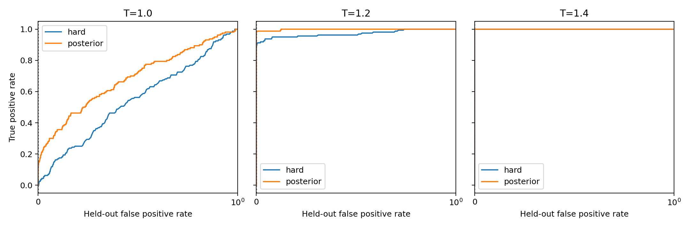

# Full Qwen3-8B-Base detector comparison — September 24, 2026

Status: **complete**. All seven approved calls finished successfully; app stopped with zero tasks.

## Main takeaways

**On the same Wang-style watermarked Qwen3-8B-Base completions, prompt-free MAP
detection recovers much of the signal missed by the published hard detector at
low temperature.** The strongest practical result is at T=1.2; a separate
calibration comparison shows that the gain comes from both threshold selection
and better scoring.

- **T=1.2: 0% → 97.5% detection with the prescribed thresholds.** MAP detects
  156/160 watermarked completions; the paired gain is +97.5 percentage points
  (95% CI +92.5 to +100). Its observed FPR at this temperature is 1/20480
  held-out null/key pairings, or 0.0049%.
- **MAP retains an advantage after calibrating both detectors to target FPR
  0.1%.** At T=1.2, hard detection reaches 89.38% and MAP reaches 98.13%:
  a paired gain of +8.75 points (95% CI +2.50 to +16.88). At T=1.0, the gain
  is +11.25 points (95% CI +3.75 to +20.63). Both intervals exclude zero;
  MAP also has lower observed FPR at these two temperatures.
- **The benefit depends on temperature.** At T=1.0, absolute MAP detection
  remains weak: 5% with its standard threshold and 11.25% after calibration.
  At T=1.4, the prescribed-threshold comparison improves from 33.75% to 100%,
  but both calibrated detectors already reach 100%. At T=1.6 the small primary
  gain has a paired interval including zero; at T=1.8 the methods tie.
- **False positives are very rare, not zero.** Standard MAP produces 4 false
  positives across 102400 held-out null/key pairings pooled over temperatures
  (0.0039%); the published hard rule produces none. These pairings contain
  400 distinct null completions and are not independent samples.
- **This establishes an improvement on Qwen3-8B-Base.** The hard detector shows
  the same low-temperature failure pattern as Wang's DeepSeek experiment.
  MAP gains on their exact DeepSeek or non-Base Qwen checkpoint, text quality,
  and resistance to their cryptanalytic attacks remain untested here.

Suggested statement for reporting the result:

> On Qwen3-8B-Base with Wang's watermark construction, completion-only MAP
> detection raises TPR at T=1.2 from 0% to 97.5% under the prescribed thresholds,
> with an observed FPR of 0.0049%. Calibrating both detectors to a global target
> FPR of 0.1% narrows the gap but preserves a MAP advantage: 89.38% versus 98.13%
> TPR, a paired gain of 8.75 percentage points (95% CI 2.50–16.88).

## Results

Both tables below evaluate **our Qwen3-8B-Base outputs**. The hard column applies
Wang's detector to those outputs; it is not a number copied from their paper.
The primary table compares the two prescribed methods, including their threshold
choices. The secondary table is the central evidence for a scoring advantage
after controlling the calibration target. "Matched FPR" means the same global
target on calibration nulls, not equal realized FPR at every temperature.

TPR intervals below are the crossed group-by-prompt bootstrap 95% intervals.
Each temperature has 160 watermarked texts and 80 held-out null texts crossed
with 256 evaluation keys (20480 pairings, not 20480 independent texts).

### Primary: each method with its specified threshold

| T | Hard, published threshold: TPR [95% CI] | MAP, standard threshold: TPR [95% CI] | Hard null FPR | MAP null FPR |
| --- | --- | --- | --- | --- |
| 1.0 | 0.00% [0.00, 0.00] | 5.00% [0.63, 11.27] | 0.0000% | 0.0000% |
| 1.2 | 0.00% [0.00, 0.00] | 97.50% [92.50, 100.00] | 0.0000% | 0.0049% |
| 1.4 | 33.75% [21.88, 45.63] | 100.00% [100.00, 100.00] | 0.0000% | 0.0098% |
| 1.6 | 98.13% [92.50, 100.00] | 100.00% [100.00, 100.00] | 0.0000% | 0.0049% |
| 1.8 | 100.00% [100.00, 100.00] | 100.00% [100.00, 100.00] | 0.0000% | 0.0000% |

### Secondary: globally calibrated at target FPR 0.1%

| T | Hard TPR [95% CI] | MAP TPR [95% CI] | Hard null FPR | MAP null FPR |
| --- | --- | --- | --- | --- |
| 1.0 | 0.00% [0.00, 0.00] | 11.25% [3.75, 20.63] | 0.1172% | 0.0293% |
| 1.2 | 89.38% [79.38, 96.88] | 98.13% [92.50, 100.00] | 0.1416% | 0.0684% |
| 1.4 | 100.00% [100.00, 100.00] | 100.00% [100.00, 100.00] | 0.0684% | 0.1465% |
| 1.6 | 100.00% [100.00, 100.00] | 100.00% [100.00, 100.00] | 0.1025% | 0.0781% |
| 1.8 | 100.00% [100.00, 100.00] | 100.00% [100.00, 100.00] | 0.0879% | 0.0928% |

Paired matched-FPR gains (MAP minus hard):

- T=1.0: +11.25 percentage points, 95% CI +3.75 to +20.63.
- T=1.2: +8.75 points, 95% CI +2.50 to +16.88.
- T=1.4: 0 points; both methods detect 160/160.

MAP also has lower realized FPR than hard at T=1.0 and T=1.2, so these gains
are not explained by a higher held-out false-positive rate.

### ROC/AUC: supporting evidence across thresholds

A ROC curve shows TPR against FPR as the detection threshold changes. AUC
summarizes the ability to rank watermarked outputs above null outputs across
that curve: 0.5 indicates chance ranking and 1 indicates perfect ranking.
It supports the comparison independently of a selected threshold, but performance
at the low FPR we actually want remains the practical criterion. Our held-out
AUC is 0.685 versus
0.545 at T=1.0 and 0.998 versus 0.971 at T=1.2 (MAP versus hard). Both reach
AUC 1.000 at T=1.4. These results support a scoring-information advantage at
the two lowest temperatures, while the very large primary gain at T=1.2 also
includes Wang's conservative-threshold effect.



### Entropy and uncertainty

At T=1.0, mean hierarchical bit entropy is 0.131 bits and latent-bit agreement
is 53.7%, compared with 0.658 bits and 75.1% at T=1.2. These diagnostics are
consistent with the much weaker watermark evidence in the lowest-temperature samples.

Zero observed FPR and degenerate bootstrap intervals do not establish zero
population FPR. Matched thresholds have the same calibration target, not identical
held-out FPR. Raw summary CSV retains harmless floating-point endpoint roundoff;
the displayed intervals are rounded to percentages.

## Comparison with Wang's original results

### Main model: DeepSeek-R1-Distill-Qwen-7B

Wang's Figure 5 reports failure at T=1.0 and T=1.2, about 60% detection at
T=1.4, and increasing detection at higher temperatures. Their released
`Deepseek_t_3_temp_all.zip` supplies the saved detection flags behind the
DeepSeek column below. These are historical saved decisions, not a fresh
recomputation of the full sweep. [Paper, Section 6.2.1 and Figure 5](https://arxiv.org/html/2512.17310v4).

| T | Wang DeepSeek: saved hard detections / N | Wang DeepSeek: hard TPR | Our 8B Base: hard TPR | Our 8B Base: MAP TPR |
| --- | --- | --- | --- | --- |
| 1.0 | 0 / 1024 | 0.00% | 0.00% | 5.00% |
| 1.2 | 0 / 1024 | 0.00% | 0.00% | 97.50% |
| 1.4 | 609 / 1024 | 59.47% | 33.75% | 100.00% |
| 1.6 | 1021 / 1024 | 99.71% | 98.13% | 100.00% |
| 1.8 | 1024 / 1024 | 100.00% | 100.00% | 100.00% |

Our columns use the prescribed thresholds and 160 completions per temperature.
The same broad hard-detector failure pattern appears in both models; the exact
rates differ. Only the two **our 8B Base** columns compare detectors on identical
outputs. The cross-model columns provide context and do not establish a paired
MAP improvement on DeepSeek. No DeepSeek MAP result was produced by this run.
Counts: [saved artifact flags](../../../cryptoanalysis_redetect/evidence/stored_flags_summary.csv).

### Qwen model: different checkpoint and different reported metric

The official artifact pins `Qwen/Qwen3-8B`; this experiment pins
`Qwen/Qwen3-8B-Base` and uses raw prompts without a chat template. They are
different model setups. [Official Qwen checkpoint script](https://github.com/1234wangtr/PRC_estimator/blob/8593e86aeb50b5f82d6c88e390b12a30f581dbaa/setup/get_llm_ablation_models.sh).

Appendix E reports Qwen **cryptanalytic attack detection**: Attack I has 33%
text TPR at 1% FPR; Attack II has 100% text TPR at 0% FPR. For comparison,
the main DeepSeek results at t=3 and T=1.8 are 61%/0% for Attack I and
100%/0% for Attack II. These evaluate an adversary after an attack, whereas
our tables evaluate the legitimate detector with the full secret key.
They are not equivalent detector baselines. Appendix E labels its model
"Qwen-3B," inconsistently with the artifact's Qwen3-8B checkpoint.
[Paper, Table 3 and Appendix E](https://arxiv.org/html/2512.17310v4).

The paper provides no corresponding Qwen five-temperature owner-detector curve
or ROC/AUC comparison. Our result shows that low-temperature detection depends
substantially on the score and threshold. It does not demonstrate recovery on
their exact model outputs, establish readability at T=1.2, or resolve the
paper's security attacks. Text quality and attack resistance were not evaluated.

## Saved outputs

- [All detector results and FPR intervals](results_summary.csv)
- [Paired differences](paired_differences.csv)
- [Primary TPR figure](tpr_vs_temperature.pdf) and [matched-FPR TPR figure](tpr_matched_fpr_vs_temperature.pdf)
- [Score versus entropy](score_vs_entropy.pdf) and [ROC curves](roc_low_temperature.pdf)
- [Mechanism diagnostics](mechanism_summary.csv)

All 35 output files (114498926 bytes) were downloaded with size checks and SHA-256
transfer records in `download_manifest.json`. The full 205600-row per-example
CSV and cached null-score arrays are in the ignored local directory
`wang_prc_detector_ablation/downloaded_results/5825fb18b52e035dfb352bae/`.
The complete trace/key/codeword cache remains in the cloud location below.

The run took **41.28 minutes** end to end; CPU scoring took **27.15 minutes**.
Runtime-derived cost is **about $4.48**, or **$4.77** including earlier checks.
Approximately **$30.23** remains from the $35 experiment budget.
Provider billing has not posted for this app; these are labeled estimates based
on measured runtimes, not a final invoice. See `billing_reconciliation.json`.

## Experiment

Pinned `Qwen/Qwen3-8B-Base`, revision
`49e3418fbbbca6ecbdf9608b4d22e5a407081db4`; BF16 generation/replay, raw Base
prompts, reasoning off. Ten Wang keys, sixteen prompts and five temperatures;
160 WM and 160 null completions per temperature, each exactly 1024 tokens.
Primary replay uses only preceding completion IDs and zero soft evidence for the
first generated token. All token IDs and generation/replay probabilities remain
in the cloud cache for CPU-only detector reruns.

Primary comparison: published Wang hard threshold versus our unchanged standard
posterior threshold. Secondary comparison: the same hard/posterior statistics
with globally calibrated, whole-tie, inclusive thresholds at nominal FPR 0.001.
The primary and matched-FPR comparisons must be interpreted separately.

## Frozen calibration

At `2026-09-24T00:34:25.592262+00:00`, the designated 400 calibration nulls crossed
with 256 independent calibration keys fixed the following cutoffs:

| Statistic | Decision | Calibration detections / pairings |
| --- | --- | --- |
| Hard, matched FPR | H <= 8551 | 102 / 102400 |
| Posterior, matched FPR | Z >= 3.0229717052487137 and V > 0 | 102 / 102400 |

The Wang published cutoff remains approximately 7232.824913450762. The standard
posterior rule remains S >= sqrt(2 V log 1000), rejecting V=0. Null evaluation
uses 400 held-out completions and 256 disjoint independent keys. No watermarked
sample sets either matched cutoff. Threshold content SHA-256:
`f5ebc433c526bb7d8fed9ce0592f8e4a342c007cf0ec2f30056bece9a7d26fcc`.

Intervals use 2000 crossed group-by-prompt bootstrap replicates. Cross-key pairs
are not independent observations; FPR inference is conditional on the fixed
held-out key pool, and matched-FPR TPR intervals condition on frozen thresholds.

## Reproduction and numerical limits

This is the requested controlled Wang-channel experiment on Qwen3-8B-Base,
not a replication of the DeepSeek model or Figure 5. The official complete
DeepSeek T=1.8 artifact validated the adapted hard detector on all 160 individual
counts/decisions, with 159/160 detections in both original and adapted code.

The earlier 2% BF16 cached/uncached check failed; the later controls showed exact
static/concatenating cache equality and close FP32 cached/uncached agreement on
one completion at prefix lengths 1, 4, 8 and 16. Maximum observed BF16 TV was
4.04%; FP32 TV was about 0.00115%. This evidence supported proceeding with the
unchanged BF16 implementation, but does not establish batch-80 or long-context
numerical equivalence. No additional short T=1.8 smoke was run. The user approved
proceeding directly to this full experiment using the completed controls.

## Execution and costs

Run commit: `3b15d2e81271f3b0194a89fd109d888c961dacb2` on `cryptoanalysis-redetection`.
Modal app: `ap-JL2Co4bAS6fq92w1TTRCyF`.
Configuration: `5825fb18b52e035dfb352bae`.
Cloud cache: `prc-data:wang_prc_detector_ablation/qwen3_8b_base/5825fb18b52e035dfb352bae`.

See `approval.json`, `quote.json`, `launch.json`, per-temperature `timing_*.json`
and `gpu_containers.json`. The seven approved calls were one 4-core/16-GiB CPU
preparation, five H100 workers (4 cores/64 GiB host RAM each; batch 80), and one
8-core/16-GiB CPU scoring/reporting call. No retry or additional compute run.

Exact launch command, from the committed isolated worktree:

```bash
MODAL_PROFILE=new-prc-watermark PYTHONUNBUFFERED=1 \
python -m wang_prc_detector_ablation.launch launch --stage experiment \
  --approval wang_prc_detector_ablation/approvals/experiment-20260924.json
```

Full paid-run quote: $12–$25. Preparation took 145.05 seconds. The five completed
GPU allocations total 3284.82 seconds (54.75 GPU-minutes, 0.91245 GPU-hours),
corresponding to approximately $4.242 including allocated CPU/RAM at quoted rates.
Final CPU timings and the pending provider-billing reconciliation are attached. The run has stopped; no further work is scheduled.
